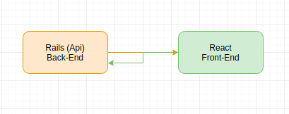

# simple-contracts-crud

> Simple application for a crud with working in contracts

A aplicação é de feita da seguinte maneira:



para que fique melhor o entedimento:

* ## `Back-End`

foi separada em uma __mini aplicação__. Onde contém a lógica de negócio. A lógica de negócio funciona da seguinte maneira:

```
User       Contract
 1 -------- x
```

Ou seja, para cada usuário, ele pode ter vários contratos, e para que isso, cada contrato conta com o seu _PDF_. Fica a cargo do usuário inserir os contratos pertinentes a negociação.

* Para ter continuar lendo sobre clique [aqui](./simple-contracts-crud-backend/README.md)

* ## `Front-End`

foi desenvolvido em __server-side rendering__, para conseguir ter a melhor perfomance, por ser tratar de uma aplicação pequena
